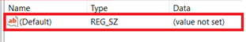
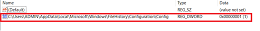
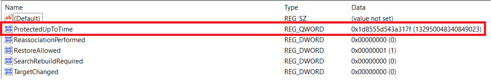
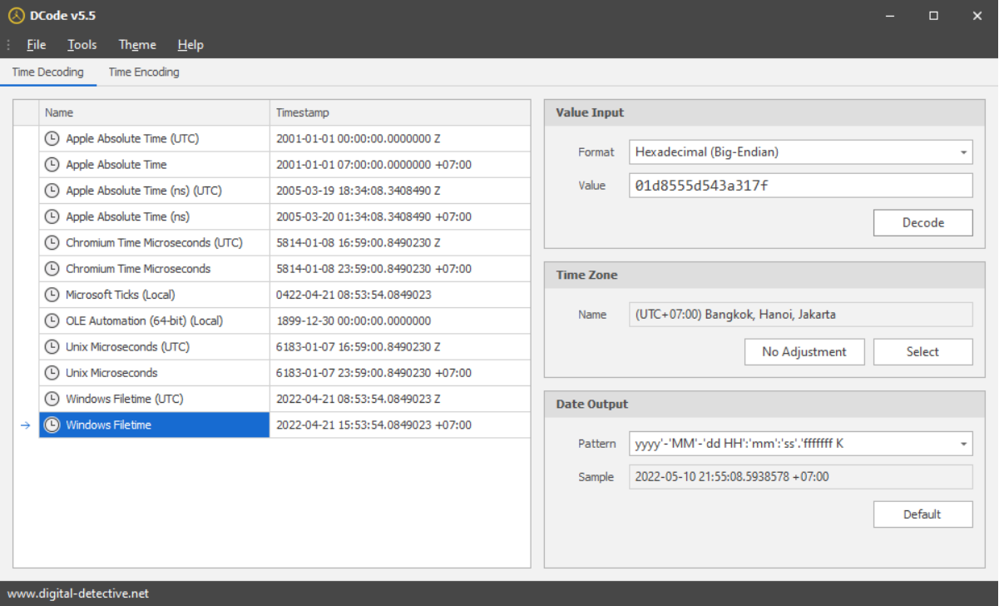
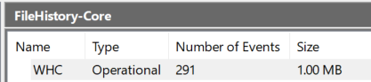
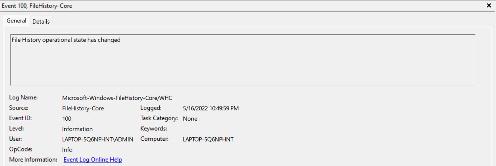
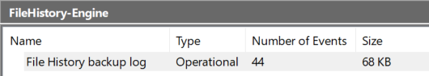
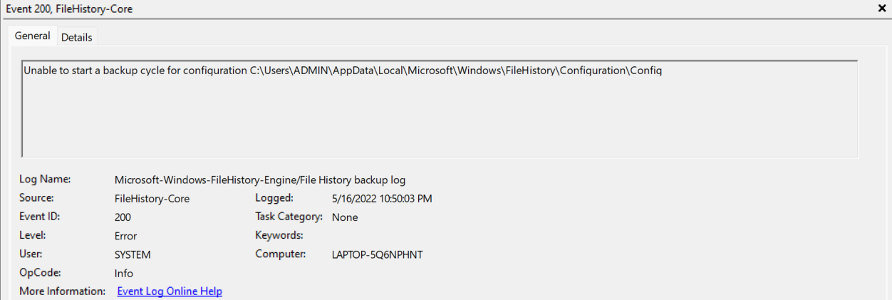
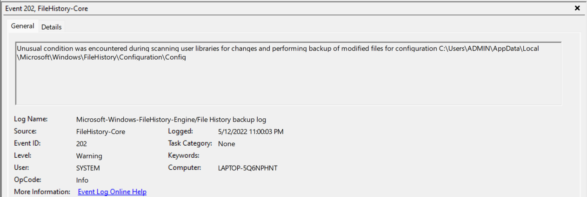

# File History - "Take it seriously now"

**Mô tả**: Tìm hiểu kỹ hơn về thông tin được lưu trữ và các file liên quan trong File History, phục vụ cho Memory Forensic

**Yêu cầu**: Tham khảo bài trước [Tutorial - File History](Fundamental-File%20History-Window.md)

Bảng nội dung;

| Sections   |
|:----------:|
| [Forensic trên Cache](#forensic-trên-cache)|
| [Forensic trên Config File](#forensic-trên-config-file)|
| [Forensic trên Registry](#forensic-trên-registry)|
| [Forensic trên Event Log](#forensic-trên-event-log)|

## Forensic trên Cache :

Cache được lưu tại `%LOCALAPPDATA%\Microsoft\Windows\FileHistory\Data` có thể hữu dụng cho việc phân tích dự phòng

## Forensic trên Config File:

Các file cấu hình và cài đặt được lưu tại đường dẫn `%LOCALAPPDATA%\Microsoft\Windows\FileHistory\Configuration`.

  
Bao gồm những file (sẽ dùng cho Forensic):
  
| File | Type (Extension) |
| ---- | ---------------- |
| [Catalog1.edb](#catalog1edb) | EDB - Extensible Storage Engine (ESE) Database |
| [Catalog2.edb](#catalog2edb)| EDB - Extensible Storage Engine (ESE) Database |
| Catalog1.jfm | (Không liên quan) |
| Catalog2.jfm | (Không liên quan) |
| [Config1.xml](#config1xml) | XML - extensible markup language |
| [Config2.xml](#config2xml) | XML - extensible markup language |

### Catalog1.edb

Đuôi mở rộng .edb - Extensible Storage Engine (ESE) Database (Tham khảo thêm: [Extensible Storage Engine](https://en.wikipedia.org/wiki/Extensible_Storage_Engine)). Là một dạng database được sử dụng rộng rãi bởi Windows cho nhiều chức năng như  Microsoft Exchange Server, Active Directory, Windows Search, ... Và ở đây file **Catalog1.edb** lưu trữ các thông tin cần thiết để cho việc backup hoạt động một cách hợp lý như metadata, id, tên file, ... 

Để hiểu rõ hơn, ta sẽ mở file bằng ứng dụng `ESEDatabaseView`. File _Catalog1.edb_ thông thường gồm 7 tables. Ta sẽ xem những table chủ yếu phục vụ cho Giám định (Examination), xem xét 4 tables sau:
- `backupset`
- `file`
- `namespace`
- `string`

Thông tin cơ bản: 

| Table | Column | Description (all time-related values are Windows 64-bit timestamps) |
| ----- | ----- | ------ |
| backupset | id | Index of backup operation
|  | timestamp | Start time of backup operation
| file | id | Index of file
| | childId | Foreign key to id column of ‘string’ table (for a file’s name)
| | parentId | Foreign key to id column of ‘string’ table (for a folder where childId is located)
| | fileSize | Backed up file’s size
| namespace | childId | Foreign key to id column of ‘string’ table (for a file or folder’s name)
| | parentId | Foreign key to id column of ‘string’ table (for a folder where childId is located)
| | fileRecordId | Foreing key to id column of ‘file’ table
| | fileCreated | File creation time
| | fileModified | File modification time
| | tCreated | Foreign key to id column of ‘backupset’ table
| | usn | Backed up file’s USN
| string | id | Index of string
| | string | Backed up file’s name or folder path

Ví dụ về quan hệ giữa các tables trong file `Catalog.edb`

Những tables khác (có thể tồn tại ):
- `library`
- `MsysLocales`
- `MsysObjects`
- `MsysObjectsShadow`
- `MSysObjids`

### Catalog2.edb

Hỗ trợ làm backup cho `Catalog1.edb`. Mọi sự thay đổi trên file `Catalog1.edb` sẽ ánh xạ vào `Catalog2.edb`

### Config1.xml

Một file định dạng XML, lưu các trường giá trị và có thể thay đổi tùy theo nhu cầu cấu hình và sử dụng. Cấu trúc các trường thông tin cơ bản như sau:

- `DataProtectionUserConfig `
  - `UserName` : Tên user của nơi được backup
  - `PCName` : ComputerName của nơi được backup
  - `UserId` : Id của user
  - `Library`
    - `LibraryName`
    - `Folder`
  - `UserFolder` : Những folders của user sẽ được backup.
  - `LocalCatalogPath1` : Nơi lưu giữ (local) file "Catalog.edb"
  - `StagingArea`
    - `StagingAreaPath`
    - `StagingAreaMaximumCapacity`
    - `StagingAreaWarningThreshold`
  - `AvailabilityPolicies`
    - `TargetAbsenceTime`
    - `TimeInUnprotectedState`
  - `RetentionPolicies`
    - `RetentionPolicyType` : Thông thường ta để thời gian giữ một _backup version_ là **Forever** trong "Control Panel". Tương đương với việc **DISABLED** chức năng này đi
    - `MinimumRetentionAge` : Thời gian tối thiểu để giữ một _backup version_ trước khi xóa nó vĩnh viễn.
  - `DPFrequency` : Khoảng thời gian tạo các bản sao lưu với các version khác nhau của ổ đĩa
  - `DPStatus` : ENABLED hoặc DISABLED tính năng trên.
  - `Target`: Cấu hình cho nơi lưu trữ tại ổ cứng/Network Drive
    - `TargetName` : Tên/nhãn(label) của ổ đĩa
    - `TargetUrl` : Tên Drive
    - `TargetVolumePath` : chỉ định "id" của ổ đĩa, sẽ nói rõ hơn trong phần liên quan đến registry
    - `TargetDriveType` : có thể là ‘Fixed’, ‘Removable’, hoặc ‘Remote’ dựa theo loại kết nối đến target. Nếu ổ cứng rời sẽ là "Fixed"
    - `TargetConfigPath1` : Nơi chứa file config "Config1.xml"
    - `TargetConfigPath2` : Nơi chứa file config (dự phòng) "Config2.xml"
    - `TargetCatalogPath1` : Nơi chứa file catalog "Catalog1.edb"
    - `TargetCatalogPath2` : Nơi chứa file catalog (dự phòng) "Catalog2.edb"
    - `TargetBackupStorePath` : Đường dẫn lưu trữ file đích trong ổ cứng/Network Drive được chuẩn bị để lưu.
    - `TargetWarningThreshold`

### Config2.xml

Hỗ trợ làm backup cho `Config1.xml`. Mọi sự thay đổi trên file `Config1.xml` sẽ ánh xạ vào `Config2.xml`

## Forensic trên Registry:

**Registry** có thể là một nơi tốt để tìm bằng chứng tiềm năng liên quan đến việc **on** hoặc **off** chức năng *FileHistory*, thời gian sao lưu gần đây nhất (last backup time), v.v ... ; ba trong số khả năng được đề cập như sau:

1. Khi bật feature *File History*, một **key**  với tên `C:\Users\Username\AppData\Local\Microsoft\Windows\FileHistory\Configuration\Config` được thêm vào cùng với giá trị  `0×00000001` tại đường dẫn  `HKEY_LOCAL_MACHINE\SYSTEM\CurrentControlSet\Services\fhsvc\Parameters\Configs`. Key này sẽ biến mất khi tính năng này bị tắt đi.

Khi tắt:

Khi bật: 

2. Ngoài ra có một **registry key** khác (có thể có) quyết định trạng thái (ON or OFF) của *File History* được lưu tại đường dẫn sau:

  - `HKEY_LOCAL_MACHINE\SYSTEM\CurrentControlSet\Services\fhsvc` -> `Start`: `0×00000003` (OFF)

  - `HKEY_LOCAL_MACHINE\SYSTEM\CurrentControlSet\Services\fhsvc` -> `Start`: `0×00000002` (ON)

3. Như đã nói trên, **Registry** còn cho phép examiner phân tích *last backup time*. The registry key `HKEY_CURRENT_USER\Software\Microsoft\Windows\CurrentVersion\FileHistory` chứa trường `ProtectedUpToTime` với giá trị timestamp ở dạng 64 bit hex big endian . Ví dụ:

Ở đây trường `ProtectedUpToTime` tại máy mình có giá trị là `1d8555d543a317f`. Ở đây mình sẽ dùng phần mềm [DCode](https://www.digital-detective.net/download/download.php?downcode=ae2znu5994j1lforlh03) để xem giá trị này dưới dạng chuỗi **DateTime** rõ luôn. 

Thời điểm backup gần nhất là : `2022-04-21 15:53:54.0849023 +07:00`

**NOTE:** Nếu hứng thú tìm câu trả lời về cách convert từ số decimal `132950048340849023` (dạng hex `1d8555d543a317f` như ta thấy) sang định dạng DateTime trên Window thì xem [tại đây](https://stackoverflow.com/questions/51001778/hex-to-from-datetime-stamp). Đại khái hệ thập phân lưu trữ 100 lần số nano second kể từ **năm 1601**. Lấy ví dụ tính chính xác đến số năm (ngày/tháng/giờ/phút/giây làm tương tự nhưng cần lấy số chính xác hơn):
- Số giây tính từ thời điểm trên sẽ là: `132950048340849023 * 10^(-9) * 100 = 13295004834.0849023` seconds
- Đổi thành Phút -> Giờ -> Ngày -> Năm: `13295004834.0849023 / 60 / 60 / 24 / 365 = 421` years
- `1601 + 421 = 2022`.
Vậy thời điểm cần tìm có năm là **2022**

## Forensic trên Event Log:

Examinate các event logs (nhật ký sự kiện) cũng vô cùng quan trọng và liên quan chặt chẽ đến dữ liệu tìm kiếm. Log files liên quan đến *File History* có thể được tìm thấy trong *Event Viewer -> Applications and Service Logs -> Microsoft -> Windows*. Có 2 event files nhìn khá là thú dzị:
- **WHC** tại sub-folder **FileHistory-Core**

Sự kiện bắt được (thông báo về sự thay đổi trang thái giữa các version):

- **File History Backup Log** tại sub-folder **FileHistory-Engine**

Sự kiện xuất hiện, ví dụ về một lỗi **Error**:

Ví dụ một lỗi khác về **Warnings**:

Số lượng mức độ thông tin (logs) tại **WHC** xuất hiện khi *File History* runs, stops, turns off hoặc on hoặc có sự thay đổi trạng thái. Mặt khác, **File History Backup Log** lưu lại những warnings hoặc errors, ví dụ, file không được backup vì lỗi abc-xyz gì đó : một lỗi bất thường xảy ra trong quá trình cuối của chu kỳ sao lưu, không thể scan các thay đổi trong user libraries  and thực hiện backup file đang bị modify, ... (Nguyên bản lỗi (Tiếng Anh): unusual condition was encountered during finalization of a backup cycle for configuration, unable to scan user libraries for changes and perform backup of modified files for configuration, ... )

References (Nguồn tham khảo):

1. [https://forensic237.rssing.com/chan-8188682/all_p2.html](https://forensic237.rssing.com/chan-8188682/all_p2.html)