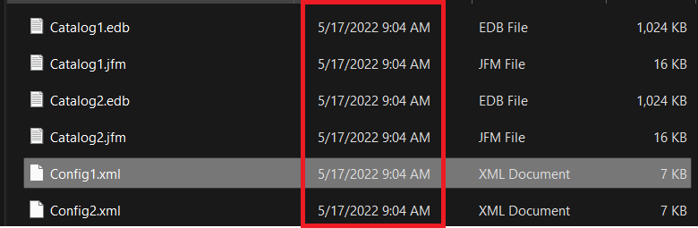

# Forensic Analysis

## 1. Thời điểm lần đầu File History được chạy ?

Thời điểm  `modified time` của thư mục *File History*  là thời điểm lần đầu tính năng File History được bật. Nếu thư mục này được xóa đi và tạo lại bằng cách bật tính năng này thì thông tin này sẽ được generate lại và có thể dẫn đến sai lệch và không phản ánh được thời điểm ban đầu.

## 2. Tình trạng service (ON hay OFF)?

Thông tin này được đề cập trong phần trước. Ta có thể xem các timestamp tại các registry.

## 3. Thời điểm lần cuối File History được chạy ?

Mỗi lần bật tắt (ON/OFF) File History sẽ làm thay đổi *thời gian chỉnh sửa (modified time)* của các file trong thư mục `Configuration`

<p align="center"></p>

Check bằng **event logs** để có thể điều tra.

## 4. Thời điểm lần cuối File History backup file ?

Như trong bài trước ở phần phân tích bằng **Registry**, **Registry** còn cho phép examiner phân tích *last backup time*. The registry key `HKEY_CURRENT_USER\Software\Microsoft\Windows\CurrentVersion\FileHistory` chứa trường `ProtectedUpToTime` với giá trị timestamp ở dạng 64 bit hex big endian.

## 5. Tên và loại thiết bị được sử dụng để backup ?

Phần này có thể được xem trong file cấu hình **Config1.xml**. Ví dụ:

```xml
<Library>
<LibraryName>*2112ab0a-c86a-4ffe-a368-0de96e47012e</LibraryName>
<Folder>C:\Users\ADMIN\Music</Folder>
</Library>
<Library>
<LibraryName>*e25b5812-be88-4bd9-94b0-29233477b6c3</LibraryName>
<Folder>C:\Users\ADMIN\Pictures\Saved Pictures</Folder>
</Library>
<Library>
<LibraryName>*491e922f-5643-4af4-a7eb-4e7a138d8174</LibraryName>
<Folder>C:\Users\ADMIN\Videos</Folder>
</Library>
<Library>
<LibraryName>*2b20df75-1eda-4039-8097-38798227d5b7</LibraryName>
<Folder>C:\Users\ADMIN\Pictures\Camera Roll</Folder>
</Library>
<Library>
<LibraryName>*7b0db17d-9cd2-4a93-9733-46cc89022e7c</LibraryName>
<Folder>C:\Users\ADMIN\Documents</Folder>
<Folder>C:\Users\ADMIN\OneDrive\Tài liệu</Folder>
</Library>
<Library>
<LibraryName>*a990ae9f-a03b-4e80-94bc-9912d7504104</LibraryName>
<Folder>C:\Users\ADMIN\Pictures</Folder>
<Folder>C:\Users\ADMIN\OneDrive\Hình ảnh</Folder>
</Library>
<UserFolder>C:\Users\ADMIN\Postman</UserFolder>
<UserFolder>C:\Users\ADMIN\Searches</UserFolder>
<UserFolder>C:\Users\ADMIN\Desktop</UserFolder>
<UserFolder>C:\Users\ADMIN\OneDrive</UserFolder>
<UserFolder>C:\Users\ADMIN\Pictures</UserFolder>
<UserFolder>C:\Users\ADMIN\Videos</UserFolder>
<UserFolder>C:\Users\ADMIN\Music</UserFolder>
<UserFolder>C:\Users\ADMIN\Downloads</UserFolder>
<UserFolder>C:\Users\ADMIN\Documents</UserFolder>
<UserFolder>C:\Users\ADMIN\Saved Games</UserFolder>
```

(Thông tin chi tiết về tên thiết bị, cấu hình, mode, ... được mô tả trong bài trước phần *Forensic trên Config File -> Config1.xml*) 

## 6. Khoảng thời gian backup được auto trigger ?

*DPFrequency* là trường trong tệp cấu hình xác định thời gian mà sau đó quá trình sao lưu tự động lặp lại. Thời gian được lưu là tính bằng giây. Theo mặc định, *DPFrequency* là 3600 (60 * 60 = 1 giờ)

## 7. Folder sẽ được backup ?

Câu trả lời cho câu hỏi này cũng có thể được tìm thấy trong tệp cấu hình. Dưới đây là một ví dụ, hãy tham khảo cấu hình mẫu trong phần 6 để biết danh sách đầy đủ các thư mục. Ví dụ một config mẫu: 

```xml
<Library>
<LibraryName>*2112ab0a-c86a-4ffe-a368-0de96e47012e</LibraryName>
<Folder>C:\Users\ADMIN\Music</Folder>
</Library>
<Library>
<LibraryName>*e25b5812-be88-4bd9-94b0-29233477b6c3</LibraryName>
<Folder>C:\Users\ADMIN\Pictures\Saved Pictures</Folder>
</Library>
<Library>
<LibraryName>*491e922f-5643-4af4-a7eb-4e7a138d8174</LibraryName>
<Folder>C:\Users\ADMIN\Videos</Folder>
</Library>
<Library>
<LibraryName>*2b20df75-1eda-4039-8097-38798227d5b7</LibraryName>
<Folder>C:\Users\ADMIN\Pictures\Camera Roll</Folder>
</Library>
<Library>
<LibraryName>*7b0db17d-9cd2-4a93-9733-46cc89022e7c</LibraryName>
<Folder>C:\Users\ADMIN\Documents</Folder>
<Folder>C:\Users\ADMIN\OneDrive\Tài liệu</Folder>
</Library>
<Library>
<LibraryName>*a990ae9f-a03b-4e80-94bc-9912d7504104</LibraryName>
<Folder>C:\Users\ADMIN\Pictures</Folder>
<Folder>C:\Users\ADMIN\OneDrive\Hình ảnh</Folder>
</Library>
<UserFolder>C:\Users\ADMIN\Postman</UserFolder>
<UserFolder>C:\Users\ADMIN\Searches</UserFolder>
<UserFolder>C:\Users\ADMIN\Desktop</UserFolder>
<UserFolder>C:\Users\ADMIN\OneDrive</UserFolder>
<UserFolder>C:\Users\ADMIN\Pictures</UserFolder>
<UserFolder>C:\Users\ADMIN\Videos</UserFolder>
<UserFolder>C:\Users\ADMIN\Music</UserFolder>
<UserFolder>C:\Users\ADMIN\Downloads</UserFolder>
<UserFolder>C:\Users\ADMIN\Documents</UserFolder>
<UserFolder>C:\Users\ADMIN\Saved Games</UserFolder>
```

Các folder được backup nằm trong tag \<UserFolder\>

## 8. Retention Policy ? 

Kiểm tra tệp cấu hình để biết thông tin này. Theo mặc định, nó là 'Forever' và điều đó có nghĩa là chính sách lưu giữ bị OFF.

```xml
<RetentionPolicies>
<RetentionPolicyType>DISABLED</RetentionPolicyType>
<MinimumRetentionAge>1</MinimumRetentionAge>
</RetentionPolicies>
```

Nếu một người thay đổi Policies, ví dụ 2 năm chẳng hạn; nó sẽ phản ánh trên file **Config1.xml** như sau:

```xml
RetentionPolicies>
<RetentionPolicyType>AGELIMIT</RetentionPolicyType>
<MinimumRetentionAge>24</MinimumRetentionAge>
</RetentionPolicies>
```